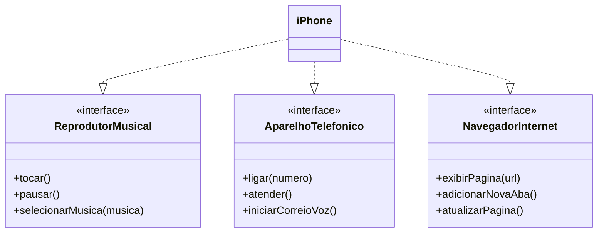

Estrutura do projeto
iPhone/

├── src/

│   └── iPhone/

│       ├── AparelhoTelefonico.java

│       ├── NavegadorInternet.java

│       ├── ReprodutorMusical.java

│       ├── iPhone.java

│       └── Main.java

└── README.md

# 📱 Projeto iPhone - Programação Orientada a Objetos

Este projeto foi desenvolvido como parte do desafio de **POO da DIO**, com base no vídeo de lançamento do iPhone (2007).

## 📌 Objetivo
Modelar e implementar as funcionalidades do iPhone utilizando **interfaces**, **classes** e **diagrama UML**.

## Funcionalidades
- Reprodutor Musical
- Aparelho Telefônico
- Navegador na Internet

##  Diagrama UML

##  Tecnologias Utilizadas
- Java
- Programação Orientada a Objetos
- UML (Mermaid)
- GitHub

##  Execução
O projeto possui uma classe `Main` responsável por executar e demonstrar as funcionalidades do iPhone.

## ✍️ Autor
André Thiago Cerillo Risperi

